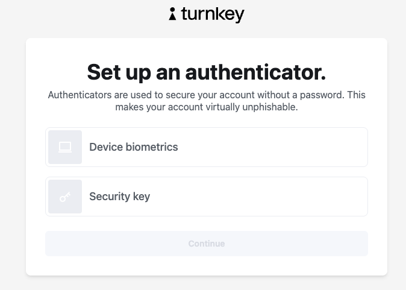
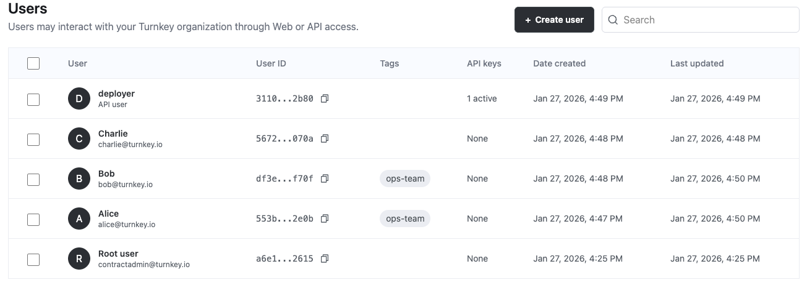
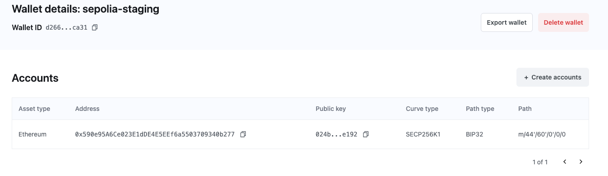

## Smart Contract Management

## Motivation

With an incredible amount of value being created and exchanged on-chain, the largest Web3 apps and businesses rely on smart contracts for mission-critical functionality. Managing the deployment and long-term maintenance of these on-chain properties can be highly manual, and put signing keys near the front lines of risk. By pairing proven cryptographic primitives with industry-standard Role-Based Access Control (RBAC) least-privilege approaches we can create highly secure, predictable, and flexible solutions.

> The companion docs page [resides here](https://docs.turnkey.com//signing-automation/code-examples/smart-contract-management).

## Example

### Overview

Turnkey’s chain agnostic, primitive-first approach is why it doesn’t matter what chain you’re building on, or tools you’re building with, or the use case you’re building for. 

A great example of smart contract management, embodying the need for high security workflows, are Stablecoins and tokenized Real-World Assets (RWAs). These contracts can be worth billions of dollars, and must meet operational needs while under intense internal and external scrutiny.  
Typical needs:

* All contract deployments and constructive/destructive actions to come from known addresses  
* Access to all addresses must be strictly permissioned  
* Private and signing keys should never be directly exposed or handled  
* Flexible in meeting both automated and manual processes

Our example demonstrates:

* Creating a Turnkey organization  
  * Populating users  
  * Creating wallets  
  * Producing policies to dictate strict access patterns  
  * Securing Turnkey organization root quorum  
* Stablecoin contract deployment  
* Code-driven contract interactions  
  * Minting token supply  
* Contract upgrade process

### Turnkey Org Setup

#### Creating an organization

It is quick, easy, and free to [create a Turnkey account](https://app.turnkey.com/dashboard/auth/initial). The process only requires an e-mail and authenticator (typically a Passkey).  


#### Creating your team

Right away only your ‘Root user’ will exist, which is a powerful admin user initially able to take any action. We’ll use it to create several non-root users representing anyone who will be able to do anything for our team \- most likely a mix of human users and automated ones.  
  
We can also create user ‘tags,’ useful for grouping users that may need similar permissions later. Non-human (machine) users will typically exist as an API key pair, though human users can later create these as well.  
All of these non-root users won’t be able to take any actions yet, as we’ve not created any wallets or allowed access to them.

#### Wallet creation

Wallets exist as cryptographic curve-level primitives, allowing great flexibility across networks. We’ll be deploying to Sepolia later, so we’ll create a wallet with Ethereum-typical derivation.
  
Once created, we can open the wallet and note the Address. Since the wallet was generated within Turnkey’s secure enclave, we should never have to directly access or expose the private key.

#### Policies

Policies are a key component of our security architecture, defining which users can do what based on a variety of parameters. By default non-root users are not able to take any actions, so we will begin by allowing the ‘deployer’ user to sign Sepolia-specific deployment transactions from the ‘sepolia-staging’ wallet.

```json
{
  "policyName": "Allow deployer to deploy test contracts",
  "effect": "EFFECT_ALLOW",
  "consensus": "approvers.any(user, user.id == '<DEPLOYER_USER_ID>')",
  "condition": "activity.action == 'SIGN' && wallet.id == '<DEPLOYER_WALLET_ID>' && eth.tx.chain_id == 11155111 && eth.tx.to == ''"
}
```

Note that:

* Policies take a familiar JSON format, but are written in a Turnkey [Domain-Specific Language](https://docs.turnkey.com/concepts/policies/language) (DSL)  
* Some of the language is general, like activity action types or wallet IDs, but some can be network or transaction type specific, like eth chain ID.  
* A policy written using transaction type specific parameters will not be valid on a network with different transaction types (e.g. Solana vs Ethereum)

And that's it \- we have the minimum to begin deploying.

These next policies depend on knowledge of the deploy address, and most likely need to be created later.

```json
{
  "policyName": "Allow token owner to mint tokens",
  "effect": "EFFECT_ALLOW",
  "consensus": "approvers.any(user, user.id == '<DEPLOYER_USER_ID>')",
  "condition": "activity.action == 'SIGN' && wallet.id == '<DEPLOYER_WALLET_ID>' && eth.tx.chain_id == 11155111 && eth.tx.to == '<Deployed_Address>' && eth.tx.data[0..10] == '0x<Function_Hash>'"
}
```

If we [upload our contract ABI](https://docs.turnkey.com/concepts/policies/smart-contract-interfaces) we could even set in policy an upper bound on how much can be minted without human ‘ops-team’ review.

We also intend to eventually upgrade the contract, though this policy should only be created when that time comes.

```json
{
  "policyName": "Allow upgrade owner to upgrade proxy",
  "effect": "EFFECT_ALLOW",
  "consensus": "approvers.any(user, user.id == '<DEPLOYER_USER_ID>')",
  "condition": "activity.action == 'SIGN' && wallet.id == '<UPGRADE_WALLET_ID>' && eth.tx.chain_id == 11155111 && eth.tx.to == '<Deployed_Address>' && eth.tx.data[0..10] == '0x<Function_Hash>'"
}
```

#### Securing Root Quorum

The first user of any org is a root user. While non-root users can’t take any actions until explicitly permissioned by policy, root users can unilaterally take any action within their organization unless the root quorum threshold is raised to 2 or more. It can be convenient during development to leave the root quorum at 1 of 1, but this should be revisited prior to any go-live.  
Consistent with our guidance on [Root Quorum](https://docs.turnkey.com/concepts/users/root-quorum), like a multi-sig we recommend at least a 2 of 3, or 3 of 5 root quorum \- meaning at least 2 root users (out of a total of 3\) explicitly approve some action. This ensures that even in the case of credential loss or compromise the remaining root users can continue without operational risk.

### Stablecoin contract deployment

It is almost certain that the nature of your smart contracts, the specific tools, and networks involved will differ from our example \- that’s okay. The approaches and security concepts outlined will be broadly transferable, and are what this demo aims to highlight.   
We will make use of [OpenZeppelin’s reference token contract](https://wizard.openzeppelin.com), employing mintable, burnable, and upgradeable extensions.

```
// SPDX-License-Identifier: MIT
// Compatible with OpenZeppelin Contracts ^5.5.0
pragma solidity ^0.8.27;

import {ERC20Upgradeable} from "@openzeppelin/contracts-upgradeable/token/ERC20/ERC20Upgradeable.sol";
import {ERC20BurnableUpgradeable} from "@openzeppelin/contracts-upgradeable/token/ERC20/extensions/ERC20BurnableUpgradeable.sol";
import {ERC20PermitUpgradeable} from "@openzeppelin/contracts-upgradeable/token/ERC20/extensions/ERC20PermitUpgradeable.sol";
import {Initializable} from "@openzeppelin/contracts/proxy/utils/Initializable.sol";
import {OwnableUpgradeable} from "@openzeppelin/contracts-upgradeable/access/OwnableUpgradeable.sol";

contract TKDemo is Initializable, ERC20Upgradeable, ERC20BurnableUpgradeable, OwnableUpgradeable, ERC20PermitUpgradeable {
    /// @custom:oz-upgrades-unsafe-allow constructor
    constructor() {
        _disableInitializers();
    }

    function initialize(address initialOwner) public initializer {
        __ERC20_init("TKDemo", "TK");
        __ERC20Burnable_init();
        __Ownable_init(initialOwner);
        __ERC20Permit_init("TKDemo");
    }

    function mint(address to, uint256 amount) public onlyOwner {
        _mint(to, amount);
    }
}
```

This contract has been prepopulated to our code demo and will be compiled with Foundry, a popular EVM-oriented smart contract development toolkit. Foundry comes with its own deploy-with-Turnkey feature, but for enhanced flexibility and tie-ins to automated flows we’ve chosen to deploy and interact using a small Typescript app.

0. #### Prerequisites

Make sure you have Foundry installed locally.

```shell
curl -L https://foundry.paradigm.xyz | bash
foundryup
```

Additionally, make sure you have Node.js installed locally; we recommend using Node v18+.

1. #### Cloning the example

```shell
git clone https://github.com/tkhq/solutions
cd solutions/smart-contract-mgmt
pnpm i
```

2. #### Setting up Turnkey

If following our guide, you should by now have these Turnkey resources:

* A public/private API key pair for a Turnkey user  
* An organization ID  
* At least one wallet

Once you've gathered these values, add them to a new .env.local file. Notice that your private key should be securely managed and never be committed to git.

```shell
cp .env.local.example .env.local
```

Now open .env.local and add the missing environment variables:

* API\_PUBLIC\_KEY  
* API\_PRIVATE\_KEY  
* ORGANIZATION\_ID  
* DEPLOYER\_ADDRESS  
* TOKEN\_OWNER  
* UPGRADE\_ADDRESS

Note that Deployer, Token Owner, and Upgrade address can be three different addresses, or the same address. If different, make sure the Turnkey User whose API credentials are being used has sufficient permissions across the different wallets.

3. #### Deploying the contract

Provided we’ve configured an API key able to sign to the DEPLOYER\_ADDRESS, and the address has some Sepolia testnet balance, the following command will:

* Use Foundry to compile the contract found in ‘foundry/src/TKDemo.sol’  
  * This contract uses 18 decimal places \- we will later replace it with 6  
* Use Viem to construct a transaction to deploy an upgradeable ERC-20 token  
* Obtain a valid transaction signature from Turnkey (using the configured credentials)  
* Submit the finished transaction to Sepolia to be included in a block

```shell
$ pnpm run deploy

Running Foundry clean & build...
[forge] forge clean
[forge] forge build
[⠊] Compiling...
[⠢] Compiling 71 files with Solc 0.8.30
[⠰] Solc 0.8.30 finished in 1.15s
Compiler run successful with warnings
Deploying TKDemo implementation...
Implementation at: 0xde32b926cbcb14fe4968e84abc3240c1ddc10174
Deploying TransparentUpgradeableProxy...
Proxy (TKDemo) at: 0x8e164d781627620d82b088cee3e943c0c658e603
Done.
```

4. #### Verifying the deployment

On success, we can run a small script to check in on the contract just deployed. If it didn’t quite make it on-chain, an error message should give you an indication what went amiss.

```shell
$ pnpm run verify-deploy

--- TKDemo deploy verification ---

Proxy address: 0x8e164d781627620d82b088cee3e943c0c658e603
Chain: Sepolia
Implementation (on-chain): 0xde32b926cbcb14fe4968e84abc3240c1ddc10174
Implementation (deploy-output): 0xde32b926cbcb14fe4968e84abc3240c1ddc10174
Match: yes

--- Deploy info ---
Name: TKDemo
Symbol: TK
Decimals: 18
Total supply: 0
Owner: 0x590e95A6Ce023E1dDE4E5EEf6a5503709340b277

...

Verification complete.
```

### Minting tokens

With the token contract on-chain, we can begin interacting with it. To mint 100 tokens, and using credentials permissioned to do so, run the below command.

```shell
$ pnpm run mint

Minting 100 tokens to 0x590e95A6Ce023E1dDE4E5EEf6a5503709340b277 ...
Minted. Tx: 0x57874bf9dda2de643855c334946606d161089733f80c60d7a16bc447125fdbcd
```

Or mint them to a specific address with:

```shell
pnpm run mint 0xADDRESS
```

If we were to attempt minting without permission, the error would resemble:

```shell
ContractFunctionExecutionError: Failed to sign: Turnkey error 7: You don't have sufficient permissions to take this action. Please add a policy granting this user permissions.
```

### Upgrading the token contract

It is typical for long lived contracts to be ‘upgradeable’ \- this means that like a memory pointer, the underlying implementation can be redirected to an improved, safer, or otherwise modified version. This is also an incredibly sensitive process, and one subject to great security considerations.

When the token contract was initially deployed we could specify different addresses for roles like minting and upgrading. Years might pass before an upgrade address is used, at which time a new or existing credential would be given special permission to use it. This might also be cause for human-operator review and approval.  
Assuming our API key has such permissions, the following command will run a script changing the number of decimal places of our ERC-20 token (18-\>6).

```shell
$ pnpm run upgrade

[⠊] Compiling...
[⠒] Compiling 71 files with Solc 0.8.30
[⠰] Solc 0.8.30 finished in 1.10s
Compiler run successful with warnings
Done. Proxy implementation: 0xe0d86ced6a2affd20d57107536ae79dedaa35f97 → run verify-deploy to confirm.
```

Similar to our initial deploy, we can check on this action with:

```shell
$ pnpm run verify-deploy

--- TKDemo deploy verification ---

Proxy address: 0x8e164d781627620d82b088cee3e943c0c658e603
Chain: Sepolia
Implementation (on-chain): 0xe0d86ced6a2affd20d57107536ae79dedaa35f97
Implementation (deploy-output): 0xe0d86ced6a2affd20d57107536ae79dedaa35f97
Match: yes

--- Deploy info ---
Name: TKDemo
Symbol: TK
Decimals: 6
Total supply: 100000000000000000000
Owner: 0x590e95A6Ce023E1dDE4E5EEf6a5503709340b277

...

Verification complete.
```

We can now remove the policy that allowed this address to be used, allowing it to remain dormant until needed again.